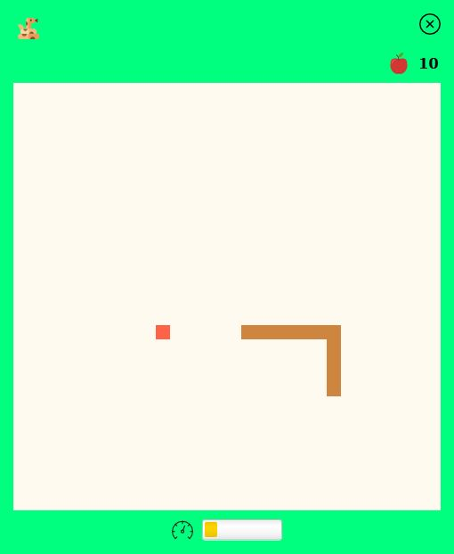

# Snake Game

This is an implementation of the snake game using [JavaFX](https://openjfx.io).


## Rules of the Game
* Use arrow keys to move the snake around the board.
* Any attempt to move the snake in the opposite direction it is moving is ignored.
* Food (apple) is generated at random positions. When the snake catches an apple, it grows longer. 1 point is also rewarded for each caught apple.
* For every 5 apples caught, the snake moves a little faster.
* There is a limit on how fast it can move, which is reflected by the indicator at the bottom of the board. 
* The game is over when the snake either runs off the board or runs into itself.

## Screenshots
#### Game in progress

#### Game over


## Running the Application
We can use [JavaFX Maven plugin](https://github.com/openjfx/javafx-maven-plugin) to create a runtime image of this application.

Once the project is downloaded onto your local system, go into the ```gui``` module and run the following on command line:
````
    mvn clean javafx:jlink
````
The runtime image can then be found in the ```target/snake/``` folder and the launcher is in ```target/snake/bin```.

Alternatively, we can compile and run the application using the plugin on command line:
````
    mvn clean javafx:run
````


## Credits
* Sound effects from [zapsplat](https://www.zapsplat.com)
* Apple icon made by [Smashicons](https://smashicons.com) from [Flaticon](https://www.flaticon.com)
* Close button icon made by [Catalin Fertu](http://catalinfertu.com) from [Flaticon](https://www.flaticon.com)
* Snake and speed icons made by [Freepik](https://www.freepik.com) from [Flaticon](https://www.flaticon.com)