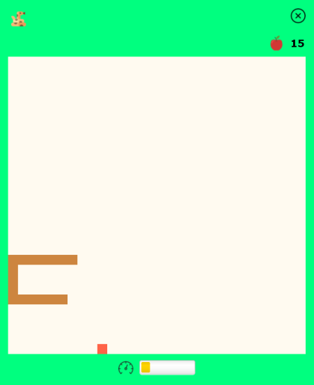
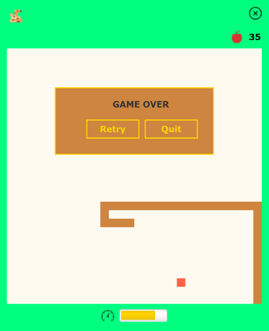

# Snake Game

This is a simple desktop snake game written in Java and [JavaFX](https://openjfx.io). My very first JavaFX application :)

## Rules of the Game
* Use arrow keys to move the snake around the board.
* Any attempt to move the snake in the opposite direction is ignored.
* Food (apple) is generated at random positions. When the snake eats an apple, it grows longer. 1 point is also rewarded for each eaten apple.
* For every 5 apples eaten, the snake moves a little faster.
* There is a limit on how fast it can move, which is reflected by the indicator at the bottom of the board. 
* The game is over when the snake either runs off the board or runs into itself.

## Look and Feel
#### Game in progress

#### Game over


## Running the Application
#### Prerequisites
* Java 15+
* Maven 3.5.3+

#### Run via Maven
We can use [JavaFX Maven plugin](https://github.com/openjfx/javafx-maven-plugin) to run the application.

Once the project is downloaded onto your local system, go to the `snake-game` directory and run the following on command line:
```
    mvn --projects core clean install
    mvn --projects gui javafx:run
```

#### Create Runtime Image
We can also use the JavaFX Maven plugin to create a custom runtime image.

In the `snake-game` directory, run the following on command line:
```
    mvn --projects core clean install
    mvn --projects gui javafx:jlink
```
The runtime image can then be found in the `gui/target/snake` directory and the launcher (named `snake.bat`, for example, on Windows) is in `gui/target/snake/bin`.

## Credits
* Sound effects from [zapsplat](https://www.zapsplat.com)
* Apple icon made by [Smashicons](https://smashicons.com) from [Flaticon](https://www.flaticon.com)
* Close button icon made by [Catalin Fertu](http://catalinfertu.com) from [Flaticon](https://www.flaticon.com)
* Snake and speed icons made by [Freepik](https://www.freepik.com) from [Flaticon](https://www.flaticon.com)
